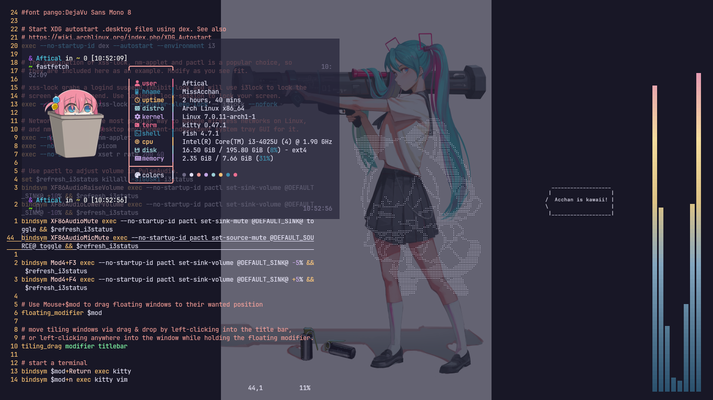

# i3 Minimal for those who just want a terminal and default vim
this is just my random i3 config

## Dependencies require!
### Arch
```
sudo pacman -S picom i3 kitty fish feh vim
```
### Fedora
```
sudo dnf install picom i3 kitty fish feh vim
```
### Debian/Ubuntu
```
sudo apt install picom i3 kitty fish feh vim
```

you can ignore hypr and kwybars that's just my bak files

## i3 screenshot


