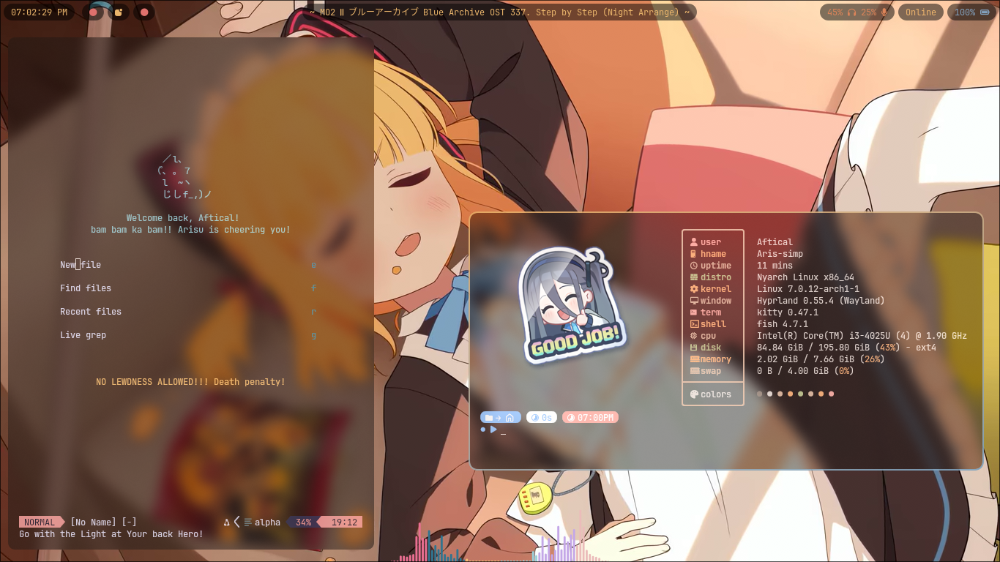
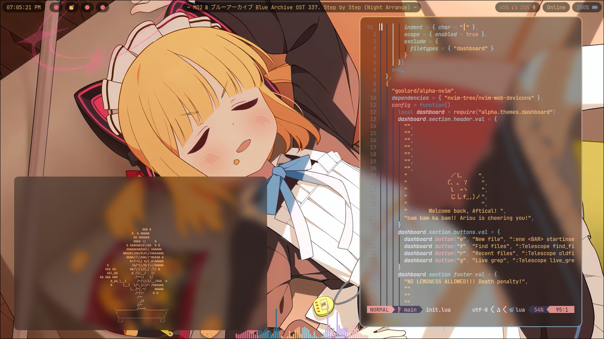

# Cleaning?... hmm... I'll do it later.....

## Dependencies require!
```
sudo pacman -S fish kitty brightnessctl waybar rofi hyprlock mpc mpd ncmpcpp
```
## AUR stuff
```
yay -S mpvpaper kwybars
```
## screenshot


